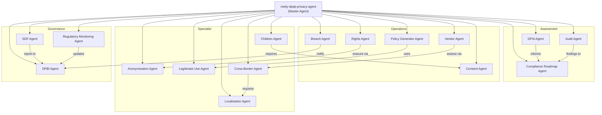
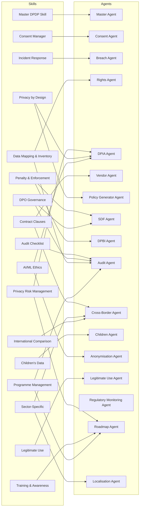

# DPDP Compliance Suite — Architecture & Dependencies

## Agent Dependency Graph

## Skill-to-Agent Mapping

Skills provide domain knowledge, checklists, and templates. Agents execute workflows. Skills are complementary to agents, not 1:1 mirrors.

## Dependency Table (Text Fallback)

| Source Agent | Depends On | Relationship |
|---|---|---|
| Breach Agent | DPBI Agent | Notifies DPBI of breaches |
| Children Agent | Consent Agent | Requires verifiable parental consent |
| Cross-Border Agent | Localisation Agent | Checks localisation requirements before transfer |
| DPIA Agent | Compliance Roadmap Agent | DPIA findings inform roadmap priorities |
| Audit Agent | Compliance Roadmap Agent | Audit findings feed into roadmap |
| Rights Agent | Anonymisation Agent | Erasure requests fulfilled via anonymisation |
| Vendor Agent | Cross-Border Agent | Vendor assessment includes cross-border checks |
| SDF Agent | DPBI Agent | SDF reports submitted to DPBI |
| Policy Generator Agent | Legitimate Use Agent | Policies reference legitimate use grounds |
| Regulatory Monitoring Agent | DPBI Agent | Regulatory updates routed to DPBI agent |
