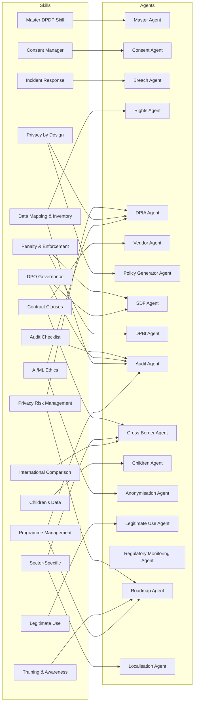

# DPDP Compliance Suite — Architecture & Dependencies

## Agent Dependency Graph

```mermaid
graph TD
    Master["meity-dpdp-privacy-agent<br/>(Master Agent)"]

    subgraph Assessment
        DPIA["DPIA Agent"]
        Audit["Audit Agent"]
        Roadmap["Compliance Roadmap Agent"]
    end

    subgraph Operations
        Consent["Consent Agent"]
        Rights["Rights Agent"]
        Breach["Breach Agent"]
        Vendor["Vendor Agent"]
        Policy["Policy Generator Agent"]
        Retain["Retention & Erasure Agent"]
        Grievance["Grievance Redressal Agent"]
        Nominate["Nomination Agent"]
        Renewal["Consent Renewal Agent"]
        Notice["Notice & Transparency Agent"]
    end

    subgraph Specialist
        Children["Children Agent"]
        Anon["Anonymisation Agent"]
        LegUse["Legitimate Use Agent"]
        CrossBorder["Cross-Border Agent"]
        Local["Localisation Agent"]
        HRData["Employee & HR Data Agent"]
        ADM["ADM & Profiling Agent"]
    end

    subgraph Governance
        SDF["SDF Agent"]
        DPBI["DPBI Agent"]
        RegMon["Regulatory Monitoring Agent"]
        Recon["Rules Reconciliation Agent"]
    end

    Master --> DPIA
    Master --> Audit
    Master --> Roadmap
    Master --> Consent
    Master --> Rights
    Master --> Breach
    Master --> Vendor
    Master --> Policy
    Master --> Children
    Master --> Anon
    Master --> LegUse
    Master --> CrossBorder
    Master --> Local
    Master --> SDF
    Master --> DPBI
    Master --> RegMon
    Master --> Recon
    Master --> Retain
    Master --> Grievance
    Master --> Nominate
    Master --> Renewal
    Master --> Notice
    Master --> HRData
    Master --> ADM

    %% Key inter-agent dependencies
    Breach -->|notify| DPBI
    Children -->|requires| Consent
    CrossBorder -->|requires| Local
    DPIA -->|informs| Roadmap
    Audit -->|findings to| Roadmap
    Rights -->|erasure via| Anon
    Vendor -->|assess via| CrossBorder
    SDF -->|report to| DPBI
    Policy -->|uses| LegUse
    RegMon -->|updates| DPBI
    Recon -->|prioritised gaps to| Roadmap
    RegMon -->|triggers re-assessment in| Recon
    Rights -->|erasure to| Retain
    Retain -->|anonymise via| Anon
    Nominate -->|rights via| Rights
    Grievance -->|escalate to| DPBI
    Renewal -->|refresh| Consent
    Notice -->|supports| Consent
    HRData -->|basis via| LegUse
    ADM -->|assess via| DPIA
    ADM -->|children ban via| Children
```

## Skill-to-Agent Mapping

Skills provide domain knowledge, checklists, and templates. Agents execute workflows. Skills are complementary to agents, not 1:1 mirrors.

```mermaid
graph LR
    subgraph Skills
        S_Master["Master DPDP Skill"]
        S_DataMap["Data Mapping & Inventory"]
        S_PbD["Privacy by Design"]
        S_Sector["Sector-Specific"]
        S_DPO["DPO Governance"]
        S_CM["Consent Manager"]
        S_Penalty["Penalty & Enforcement"]
        S_Train["Training & Awareness"]
        S_AI["AI/ML Ethics"]
        S_IR["Incident Response"]
        S_Audit["Audit Checklist"]
        S_Risk["Privacy Risk Management"]
        S_Children["Children's Data"]
        S_Contract["Contract Clauses"]
        S_Intl["International Comparison"]
        S_LegUse["Legitimate Use"]
        S_PPM["Programme Management"]
    end

    subgraph Agents
        A_Master["Master Agent"]
        A_Consent["Consent Agent"]
        A_Breach["Breach Agent"]
        A_Rights["Rights Agent"]
        A_DPIA["DPIA Agent"]
        A_Vendor["Vendor Agent"]
        A_Policy["Policy Generator Agent"]
        A_SDF["SDF Agent"]
        A_DPBI["DPBI Agent"]
        A_Audit["Audit Agent"]
        A_CrossBorder["Cross-Border Agent"]
        A_Children["Children Agent"]
        A_Anon["Anonymisation Agent"]
        A_LegUse["Legitimate Use Agent"]
        A_RegMon["Regulatory Monitoring Agent"]
        A_Roadmap["Roadmap Agent"]
        A_Local["Localisation Agent"]
    end

    %% Direct domain overlaps
    S_Master --> A_Master
    S_Children --> A_Children
    S_LegUse --> A_LegUse
    S_Audit --> A_Audit

    %% Skills informing multiple agents
    S_CM --> A_Consent
    S_IR --> A_Breach
    S_Contract --> A_Vendor
    S_Contract --> A_CrossBorder
    S_Penalty --> A_DPBI
    S_Penalty --> A_SDF
    S_DPO --> A_SDF
    S_DPO --> A_Audit
    S_Risk --> A_DPIA
    S_Risk --> A_Roadmap
    S_PbD --> A_DPIA
    S_PbD --> A_Policy
    S_Sector --> A_Local
    S_Sector --> A_CrossBorder
    S_AI --> A_DPIA
    S_AI --> A_Anon
    S_Intl --> A_CrossBorder
    S_DataMap --> A_Audit
    S_DataMap --> A_Rights
    S_Train --> A_Roadmap
    S_PPM --> A_Roadmap
    S_PPM --> A_Audit
```

## Dependency Table (Text Fallback)

| Source Agent | Depends On | Relationship |
|---|---|---|
| Breach Agent | DPBI Agent | Notifies DPBI of breaches |
| Children Agent | Consent Agent | Requires verifiable parental consent |
| Cross-Border Agent | Localisation Agent | Checks localisation requirements before transfer |
| DPIA Agent | Compliance Roadmap Agent | DPIA findings inform roadmap priorities |
| Audit Agent | Compliance Roadmap Agent | Audit findings feed into roadmap |
| Rights Agent | Anonymisation Agent | Erasure requests fulfilled via anonymisation |
| Vendor Agent | Cross-Border Agent | Vendor assessment includes cross-border checks |
| SDF Agent | DPBI Agent | SDF reports submitted to DPBI |
| Policy Generator Agent | Legitimate Use Agent | Policies reference legitimate use grounds |
| Regulatory Monitoring Agent | DPBI Agent | Regulatory updates routed to DPBI agent |
| Rules Reconciliation Agent | Compliance Roadmap Agent | Prioritised per-Rule gaps feed the roadmap |
| Rules Reconciliation Agent | Regulatory Monitoring Agent | New notifications trigger re-assessment |
| Retention & Erasure Agent | Anonymisation Agent | Anonymisation where deletion is infeasible |
| Retention & Erasure Agent | Rights Request Agent | Fulfils erasure requests |
| Nomination Agent | Rights Request Agent | Nominee exercises Data Principal rights |
| Grievance Redressal Agent | DPBI Complaint Response Agent | Escalates exhausted grievances |
| Consent Renewal Agent | Consent Management Agent | Refreshes and re-collects consent |
| Notice & Transparency Agent | Consent Management Agent | Notice supports and precedes consent |
| Employee & HR Data Agent | Legitimate Use Agent | Employment processing basis (S.7(i)) |
| ADM & Profiling Agent | DPIA Agent | DPIA for high-risk automated decisions |
