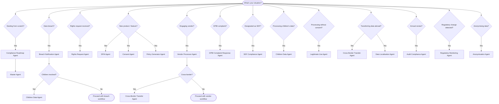

# DPDP Compliance Decision Tree — Which Agent Do I Need?

Use the flowchart below to identify the right agent for your situation. If the Mermaid diagram does not render, refer to the quick reference table further down.

---

## Decision Flowchart

---

## Quick Reference Table (Fallback)

| Situation | Primary Agent | Secondary Agent(s) | Relevant Skill(s) |
|---|---|---|---|
| Starting from scratch | Compliance Roadmap Agent | Master Agent | Programme Management, Audit Checklist |
| Data breach | Breach Notification Agent | Children Data Agent (if minors involved) | Incident Response, Penalty & Enforcement |
| Rights request received | Rights Request Agent | — | Data Mapping & Inventory |
| New product / feature | DPIA Agent | Consent Agent, Policy Generator Agent | Privacy by Design, Privacy Risk Management |
| Engaging vendor | Vendor Processor Agent | Cross-Border Transfer Agent (if overseas) | Contract Clauses |
| DPBI complaint | DPBI Complaint Response Agent | — | Penalty & Enforcement |
| Designated as SDF | SDF Compliance Agent | — | DPO Governance, Audit Checklist |
| Processing children's data | Children Data Agent | — | Children's Data |
| Processing without consent | Legitimate Use Agent | — | Legitimate Use |
| Transferring data abroad | Cross-Border Transfer Agent | Data Localisation Agent | International Comparison, Sector-Specific |
| Annual review | Audit Compliance Agent | — | Audit Checklist, Programme Management |
| Regulatory change detected | Regulatory Monitoring Agent | — | Sector-Specific |
| Anonymising data | Anonymisation Agent | — | AI/ML Ethics |
| Need to train staff | — | — | Training & Awareness |
| Need to draft / update privacy policy | Policy Document Generator Agent | — | Privacy by Design |
| Need contract / DPA clauses | — | Vendor Processor Agent | Contract Clauses |
| AI/ML processing | DPIA Agent | — | AI/ML Ethics, Privacy by Design |
