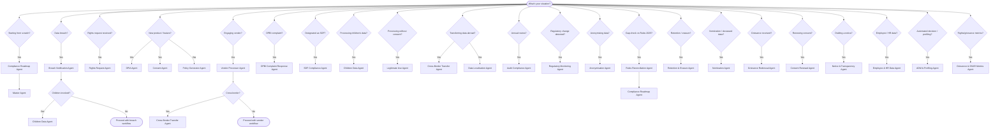

# DPDP Compliance Decision Tree — Which Agent Do I Need?

Use the flowchart below to identify the right agent for your situation. If the Mermaid diagram does not render, refer to the quick reference table further down.

---

## Decision Flowchart

```mermaid
flowchart TD
    START([What's your situation?]) --> A{Starting from scratch?}
    START --> B{Data breach?}
    START --> C{Rights request received?}
    START --> D{New product / feature?}
    START --> E{Engaging vendor?}
    START --> F{DPBI complaint?}
    START --> G{Designated as SDF?}
    START --> H{Processing children's data?}
    START --> I{Processing without consent?}
    START --> J{Transferring data abroad?}
    START --> K{Annual review?}
    START --> L{Regulatory change detected?}
    START --> M{Anonymising data?}
    START --> N{Gap-check vs Rules 2025?}
    START --> O{Retention / erasure?}
    START --> P{Nomination / deceased data?}
    START --> Q{Grievance received?}
    START --> R{Renewing consent?}
    START --> S{Drafting a notice?}
    START --> T{Employee / HR data?}
    START --> U{Automated decision / profiling?}
    START --> V{Rights/grievance metrics?}

    A -->|Yes| A1[Compliance Roadmap Agent]
    A1 --> A2[Master Agent]

    B -->|Yes| B1[Breach Notification Agent]
    B1 --> B2{Children involved?}
    B2 -->|Yes| B3[Children Data Agent]
    B2 -->|No| B4([Proceed with breach workflow])

    C -->|Yes| C1[Rights Request Agent]

    D -->|Yes| D1[DPIA Agent]
    D -->|Yes| D2[Consent Agent]
    D -->|Yes| D3[Policy Generator Agent]

    E -->|Yes| E1[Vendor Processor Agent]
    E1 --> E2{Cross-border?}
    E2 -->|Yes| E3[Cross-Border Transfer Agent]
    E2 -->|No| E4([Proceed with vendor workflow])

    F -->|Yes| F1[DPBI Complaint Response Agent]

    G -->|Yes| G1[SDF Compliance Agent]

    H -->|Yes| H1[Children Data Agent]

    I -->|Yes| I1[Legitimate Use Agent]

    J -->|Yes| J1[Cross-Border Transfer Agent]
    J -->|Yes| J2[Data Localisation Agent]

    K -->|Yes| K1[Audit Compliance Agent]

    L -->|Yes| L1[Regulatory Monitoring Agent]

    M -->|Yes| M1[Anonymisation Agent]

    N -->|Yes| N1[Rules Reconciliation Agent]
    N1 --> N2[Compliance Roadmap Agent]

    O -->|Yes| O1[Retention & Erasure Agent]
    P -->|Yes| P1[Nomination Agent]
    Q -->|Yes| Q1[Grievance Redressal Agent]
    R -->|Yes| R1[Consent Renewal Agent]

    S -->|Yes| S1[Notice & Transparency Agent]
    T -->|Yes| T1[Employee & HR Data Agent]
    U -->|Yes| U1[ADM & Profiling Agent]
    V -->|Yes| V1[Grievance & DSAR Metrics Agent]
```

---

## Quick Reference Table (Fallback)

| Situation | Primary Agent | Secondary Agent(s) | Relevant Skill(s) |
|---|---|---|---|
| Starting from scratch | Compliance Roadmap Agent | Master Agent | Programme Management, Audit Checklist |
| Data breach | Breach Notification Agent | Children Data Agent (if minors involved) | Incident Response, Penalty & Enforcement |
| Rights request received | Rights Request Agent | — | Data Mapping & Inventory |
| New product / feature | DPIA Agent | Consent Agent, Policy Generator Agent | Privacy by Design, Privacy Risk Management |
| Engaging vendor | Vendor Processor Agent | Cross-Border Transfer Agent (if overseas) | Contract Clauses |
| DPBI complaint | DPBI Complaint Response Agent | — | Penalty & Enforcement |
| Designated as SDF | SDF Compliance Agent | — | DPO Governance, Audit Checklist |
| Processing children's data | Children Data Agent | — | Children's Data |
| Processing without consent | Legitimate Use Agent | — | Legitimate Use |
| Transferring data abroad | Cross-Border Transfer Agent | Data Localisation Agent | International Comparison, Sector-Specific |
| Annual review | Audit Compliance Agent | — | Audit Checklist, Programme Management |
| Regulatory change detected | Regulatory Monitoring Agent | — | Sector-Specific |
| Gap-check against notified Rules 2025 | Rules Reconciliation Agent | Compliance Roadmap Agent, Regulatory Monitoring Agent | Audit Checklist |
| Setting retention or erasing data | Retention & Erasure Agent | Anonymisation Agent, Rights Request Agent | Retention Schedule |
| Nomination or deceased-data handling | Nomination Agent | Rights Request Agent, Retention & Erasure Agent | — |
| Data Principal grievance | Grievance Redressal Agent | DPBI Complaint Response Agent | DPO Governance |
| Renewing or refreshing consent | Consent Renewal Agent | Consent Management Agent, Children Data Agent | Consent Manager |
| Drafting or localising a notice | Notice & Transparency Agent | Consent Management Agent, Policy Document Generator Agent | Notice Drafting |
| Employee or HR data processing | Employee & HR Data Agent | Legitimate Use Agent, Consent Management Agent | Sector-Specific |
| Automated decision-making or profiling | ADM & Profiling Agent | DPIA Agent, Children Data Agent | AI/ML Ethics |
| Rights/grievance metrics & SLA reporting | Grievance & DSAR Metrics Agent | Rights Request Agent, Grievance Redressal Agent | Privacy Programme Management |
| Anonymising data | Anonymisation Agent | — | AI/ML Ethics |
| Need to train staff | — | — | Training & Awareness |
| Need to draft / update privacy policy | Policy Document Generator Agent | — | Privacy by Design |
| Need contract / DPA clauses | — | Vendor Processor Agent | Contract Clauses |
| AI/ML processing | DPIA Agent | — | AI/ML Ethics, Privacy by Design |
