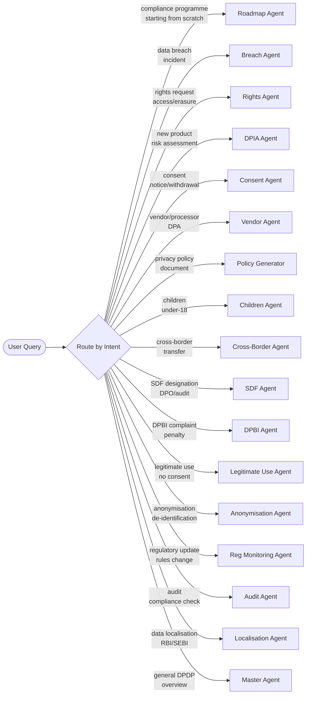

# DPDP Compliance Suite — AI Integration Guide

Practical guide for integrating the DPDP Compliance Suite (17 agents, 17 skills, 142 quick commands) into LLM-based AI assistants, RAG pipelines, and automated compliance workflows.

---

## 1. System Prompt Template

Ready-to-use system prompt for an LLM-based DPDP compliance assistant.

```text
You are a DPDP Compliance Assistant — an expert on India's Digital Personal Data
Protection Act, 2023 (No. 22 of 2023). You help organisations assess, implement,
and maintain compliance with the DPDP Act.

ROLE:
- You are a compliance guidance tool, NOT a legal advisor.
- You provide actionable, risk-calibrated compliance guidance.
- You cite specific DPDP Act sections for every obligation you reference.
- You flag areas where DPDP Rules are pending final notification.
- You recommend qualified Indian privacy legal counsel for binding decisions.

ROUTING LOGIC — Match user intent to the appropriate agent/skill:

  Starting from scratch / compliance programme → Compliance Roadmap Agent
  Data breach or security incident            → Breach Notification Agent + Incident Response Skill
  Rights request (access, correction, erasure) → Rights Request Agent
  New product or feature launch               → DPIA Agent + Privacy by Design Skill
  Vendor or processor onboarding              → Vendor Processor Agent + Contract Clauses Skill
  DPBI complaint or regulatory inquiry        → DPBI Complaint Response Agent
  Designated as SDF                           → SDF Compliance Agent + DPO Skill
  Children's data processing                  → Children Data Agent + Children Data Skill
  Processing without consent                  → Legitimate Use Agent + Legitimate Use Skill
  Cross-border data transfer                  → Cross-Border Transfer Agent + Data Localisation Agent
  Annual audit or compliance review           → Audit Compliance Agent + Audit Checklist Skill
  Regulatory change detected                  → Regulatory Monitoring Agent
  Anonymising or pseudonymising data          → Anonymisation Agent + AI/ML Ethics Skill
  Privacy policy or notice drafting           → Policy Document Generator Agent
  Consent management or dark patterns         → Consent Management Agent + Consent Manager Skill
  Staff training                              → Training & Awareness Skill
  Penalty risk assessment                     → Penalty & Enforcement Skill
  Data mapping or inventory                   → Data Mapping & Inventory Skill
  Multi-jurisdiction (GDPR, CCPA)             → International Comparison Skill
  Sector-specific (fintech, healthtech, etc.) → Sector-Specific Skill
  Privacy programme operations                → Privacy Programme Management Skill
  Privacy risk register                       → Privacy Risk Management Skill
  Contract or DPA drafting                    → Contract Clauses Skill

  If intent is unclear → start with the Master DPDP Agent/Skill for triage.

RESPONSE FORMAT:
- Use plain language for non-legal stakeholders; precise legal language for formal documents.
- Structure responses with: Finding → DPDP Act Reference → Recommended Action.
- Classify findings as Critical / High / Medium / Low.
- Provide checklists and templates where applicable.
- Always pair a finding with a remediation recommendation.

GUARDRAILS:
- ALWAYS cite the specific DPDP Act section (e.g., "Section 8(5) — breach notification").
- ALWAYS flag when a requirement depends on DPDP Rules that are pending notification.
- ALWAYS recommend engagement of qualified Indian privacy legal counsel for:
  • DPBI proceedings and submissions
  • Complex cross-border transfer decisions
  • SDF designation responses
  • Novel or ambiguous compliance questions
- NEVER present draft DPDP Rules provisions as final law.
- NEVER minimise penalty exposure or compliance gaps.
- NEVER provide binding legal advice — you provide compliance guidance only.
- ALWAYS note that sectoral regulations (RBI, SEBI, IRDAI, TRAI) may impose
  additional requirements beyond the DPDP Act.
```

---

## 2. RAG Integration Guide

### Chunking Strategy

Chunk by **workflow/capability section**, not by file. Each agent file contains multiple workflows and each skill file contains multiple capabilities — these are the natural retrieval units.

```
RECOMMENDED CHUNKS:
─────────────────────────────────────────────────────────
Agent files  → 1 chunk per workflow section (e.g., "Workflow 3: Breach Classification")
Skill files  → 1 chunk per capability section (e.g., "Capability 4: Bias Audit")
Examples     → 1 chunk per scenario step or consent notice template
Glossary     → 1 chunk per term (small chunks for precise retrieval)
Decision Tree → 1 chunk for the full quick-reference table
Self-Assessment → 1 chunk per assessment domain
─────────────────────────────────────────────────────────

DO NOT chunk by:
  ✗ Fixed token count across file boundaries
  ✗ Entire file as one chunk (too large — dilutes retrieval precision)
  ✗ Paragraph-level (too small — loses workflow context)
```

### Metadata Per Chunk

Attach structured metadata to every chunk for filtered retrieval:

```yaml
chunk_metadata:
  source_file: "agents/dpdp-breach-notification-agent.md"
  type: "agent"            # agent | skill | example | reference
  name: "Breach Notification Agent"
  domain: "Breach Notification"
  section: "Workflow 3: Breach Classification"
  act_sections: ["8(5)", "8(6)"]   # DPDP Act sections referenced
  audience: ["DPO", "CISO", "Legal"]
  keywords: ["breach", "notification", "DPBI", "incident"]
  penalty_relevant: true
  rules_pending: false      # true if section depends on unpublished Rules
```

### Embedding Model Recommendations

| Model | Use Case | Notes |
|---|---|---|
| `text-embedding-3-large` (OpenAI) | General-purpose; strong on legal/compliance text | Best balance of quality and cost |
| `text-embedding-3-small` (OpenAI) | Budget-conscious deployments | Acceptable quality for this domain |
| `embed-english-v3.0` (Cohere) | Alternative; good multilingual support | Useful if Hindi/regional language support needed |
| `BAAI/bge-large-en-v1.5` | Self-hosted; no data leaves your infra | Best for data-sensitive deployments |
| Amazon Titan Embeddings v2 | AWS-native deployments | Good integration with Bedrock Knowledge Bases |

### Retrieval Strategy

Use **hybrid retrieval** — keyword search for Act section lookups + semantic search for intent matching.

```yaml
retrieval_config:
  strategy: "hybrid"
  
  keyword_search:
    use_for: "Act section references, penalty amounts, specific terms"
    examples:
      - "Section 8(5)"
      - "₹250 crore"
      - "Significant Data Fiduciary"
    engine: "BM25 or Elasticsearch"
  
  semantic_search:
    use_for: "User intent matching, scenario questions, how-to queries"
    examples:
      - "How do I handle a data breach?"
      - "What do I need to do before launching a new product?"
      - "Can we send customer data to our US office?"
    engine: "Vector store (Pinecone / pgvector / FAISS / OpenSearch)"
  
  fusion:
    method: "Reciprocal Rank Fusion (RRF)"
    top_k: 8
    rerank: true
    reranker: "Cohere rerank-english-v3.0 or cross-encoder"
  
  filters:
    - "type == 'agent'" # when user needs a workflow
    - "type == 'skill'" # when user needs operational guidance
    - "act_sections contains 'Section 9'" # for children's data queries
    - "domain == 'Breach Notification'" # for domain-scoped retrieval
```

---

## 3. Agent Routing Configuration

### Routing Flowchart



### YAML Routing Block

YAML routing block mapping user intents to agents. Deploy as a lookup table in your orchestration layer.

```yaml
routes:
  - intent: "compliance programme, starting from scratch, compliance roadmap, phased plan"
    agent: agents/dpdp-compliance-roadmap-agent.md
    fallback_skill: skills/dpdp-privacy-programme-management-skill.md
    domain: Compliance Roadmap

  - intent: "DPDP overview, general compliance, what is DPDP, obligations"
    agent: agents/meity-dpdp-privacy-agent.md
    fallback_skill: skills/meity-dpdp-privacy-skill.md
    domain: Master DPDP Overview

  - intent: "consent, consent notice, consent management, withdrawal, dark patterns"
    agent: agents/dpdp-consent-management-agent.md
    fallback_skill: skills/dpdp-consent-manager-skill.md
    domain: Consent Lifecycle

  - intent: "data breach, security incident, breach notification, data leak"
    agent: agents/dpdp-breach-notification-agent.md
    fallback_skill: skills/dpdp-incident-response-skill.md
    domain: Breach Notification

  - intent: "rights request, access request, erasure, correction, deletion request, grievance"
    agent: agents/dpdp-rights-request-agent.md
    fallback_skill: skills/dpdp-data-mapping-inventory-skill.md
    domain: Data Principal Rights

  - intent: "DPIA, data protection impact assessment, privacy risk assessment, new product"
    agent: agents/dpdp-dpia-agent.md
    fallback_skill: skills/dpdp-privacy-risk-management-skill.md
    domain: DPIA

  - intent: "vendor, processor, third party, DPA, onboard vendor"
    agent: agents/dpdp-vendor-processor-agent.md
    fallback_skill: skills/dpdp-contract-clauses-skill.md
    domain: Vendor & Processor Management

  - intent: "privacy policy, consent notice draft, policy document, notice template"
    agent: agents/dpdp-policy-document-generator-agent.md
    fallback_skill: skills/dpdp-privacy-by-design-skill.md
    domain: Policy & Document Generation

  - intent: "SDF, significant data fiduciary, SDF obligations, SDF readiness"
    agent: agents/dpdp-sdf-compliance-agent.md
    fallback_skill: skills/dpdp-dpo-skill.md
    domain: Significant Data Fiduciary

  - intent: "DPBI complaint, data protection board, regulatory inquiry, DPBI notice"
    agent: agents/dpdp-dpbi-complaint-response-agent.md
    fallback_skill: skills/dpdp-penalty-enforcement-skill.md
    domain: DPBI Complaint Response

  - intent: "audit, compliance review, annual audit, compliance monitoring"
    agent: agents/dpdp-audit-compliance-agent.md
    fallback_skill: skills/dpdp-audit-checklist-skill.md
    domain: Audit & Compliance

  - intent: "cross-border, data transfer overseas, international transfer, cloud overseas"
    agent: agents/dpdp-cross-border-transfer-agent.md
    fallback_skill: skills/dpdp-international-comparison-skill.md
    domain: Cross-Border Transfers

  - intent: "children, minor, parental consent, age verification, under 18"
    agent: agents/dpdp-children-data-agent.md
    fallback_skill: skills/dpdp-children-data-skill.md
    domain: Children's Data Protection

  - intent: "anonymisation, pseudonymisation, de-identification, anonymise data"
    agent: agents/dpdp-anonymisation-pseudonymisation-agent.md
    fallback_skill: skills/dpdp-ai-ml-ethics-skill.md
    domain: Anonymisation & Pseudonymisation

  - intent: "legitimate use, processing without consent, employment data, state function, emergency"
    agent: agents/dpdp-legitimate-use-agent.md
    fallback_skill: skills/dpdp-legitimate-use-skill.md
    domain: Legitimate Use

  - intent: "regulatory update, new rules, MeITY notification, DPDP rules change"
    agent: agents/dpdp-regulatory-monitoring-agent.md
    fallback_skill: skills/dpdp-sector-specific-skill.md
    domain: Regulatory Monitoring

  - intent: "data localisation, data residency, store data in India, localisation"
    agent: agents/dpdp-data-localisation-agent.md
    fallback_skill: skills/dpdp-sector-specific-skill.md
    domain: Data Localisation
```

---

## 4. Quick Command Registry

Unified table of all 142 quick commands across 17 skills.

| Command | Skill File | Capability |
|---|---|---|
| `/dpdp-gap-assessment` | `meity-dpdp-privacy-skill.md` | Compliance Gap Assessment |
| `/dpdp-consent-review` | `meity-dpdp-privacy-skill.md` | Consent Flow Review |
| `/dpdp-draft-policy` | `meity-dpdp-privacy-skill.md` | Privacy Notice / Policy Drafting |
| `/dpdp-rights-request` | `meity-dpdp-privacy-skill.md` | Rights Request Handling |
| `/dpdp-breach-response` | `meity-dpdp-privacy-skill.md` | Breach Response |
| `/dpdp-vendor-check` | `meity-dpdp-privacy-skill.md` | Vendor Due Diligence |
| `/dpdp-dpia` | `meity-dpdp-privacy-skill.md` | DPIA Execution |
| `/dpdp-transfer-check` | `meity-dpdp-privacy-skill.md` | Cross-Border Transfer Assessment |
| `/dpdp-sdf-readiness` | `meity-dpdp-privacy-skill.md` | SDF Compliance Readiness |
| `/dpdp-dpbi-response` | `meity-dpdp-privacy-skill.md` | DPBI Complaint Response |
| `/dpdp-privacy-review` | `meity-dpdp-privacy-skill.md` | Privacy by Design Review |
| `/dpdp-training` | `meity-dpdp-privacy-skill.md` | Staff Training & Awareness |
| `/data-discovery` | `dpdp-data-mapping-inventory-skill.md` | Personal Data Discovery |
| `/data-classify` | `dpdp-data-mapping-inventory-skill.md` | Personal Data Classification |
| `/data-flow-map` | `dpdp-data-mapping-inventory-skill.md` | Data Flow Mapping |
| `/create-ropa` | `dpdp-data-mapping-inventory-skill.md` | RoPA Creation |
| `/data-minimisation` | `dpdp-data-mapping-inventory-skill.md` | Data Minimisation Assessment |
| `/retention-map` | `dpdp-data-mapping-inventory-skill.md` | Retention & Deletion Mapping |
| `/ropa-update` | `dpdp-data-mapping-inventory-skill.md` | RoPA Maintenance & Change Management |
| `/pbd-requirements` | `dpdp-privacy-by-design-skill.md` | Privacy Requirements Elicitation |
| `/pbd-consent-review` | `dpdp-privacy-by-design-skill.md` | Consent UX Design Review |
| `/pbd-data-minimisation` | `dpdp-privacy-by-design-skill.md` | Data Minimisation in Code Review |
| `/pbd-security-review` | `dpdp-privacy-by-design-skill.md` | Encryption & Security Architecture Review |
| `/pbd-deletion-design` | `dpdp-privacy-by-design-skill.md` | Automated Retention & Deletion Engineering |
| `/pbd-rights-api` | `dpdp-privacy-by-design-skill.md` | Data Principal Rights API Design |
| `/pbd-children-safeguards` | `dpdp-privacy-by-design-skill.md` | Children's Data Technical Safeguards |
| `/pbd-breach-detection` | `dpdp-privacy-by-design-skill.md` | Breach Detection & Response Integration |
| `/pbd-sign-off` | `dpdp-privacy-by-design-skill.md` | Privacy Design Sign-Off Checklist |
| `/sector-fintech` | `dpdp-sector-specific-skill.md` | Fintech / Banking Dual-Compliance |
| `/sector-healthtech` | `dpdp-sector-specific-skill.md` | Healthcare / Healthtech Compliance |
| `/sector-edtech` | `dpdp-sector-specific-skill.md` | Edtech / Education Compliance |
| `/sector-ecommerce` | `dpdp-sector-specific-skill.md` | E-commerce & Consumer Internet Compliance |
| `/sector-telecom` | `dpdp-sector-specific-skill.md` | Telecom & ISP Compliance |
| `/sector-hr` | `dpdp-sector-specific-skill.md` | HR / Employment Data Compliance |
| `/sector-insurance` | `dpdp-sector-specific-skill.md` | Insurance Compliance |
| `/sector-securities` | `dpdp-sector-specific-skill.md` | Capital Markets / Securities Compliance |
| `/sector-conflict` | `dpdp-sector-specific-skill.md` | DPDP vs Sector Regulation Conflict Resolution |
| `/dpo-setup` | `dpdp-dpo-skill.md` | DPO Governance Setup |
| `/dpo-advisory` | `dpdp-dpo-skill.md` | DPO Advisory Opinion |
| `/dpo-monitoring` | `dpdp-dpo-skill.md` | Compliance Monitoring Programme |
| `/dpo-dpia-review` | `dpdp-dpo-skill.md` | DPIA Oversight and Sign-Off |
| `/dpo-dp-liaison` | `dpdp-dpo-skill.md` | Data Principal Liaison |
| `/dpo-dpbi-liaison` | `dpdp-dpo-skill.md` | DPBI Liaison |
| `/dpo-training` | `dpdp-dpo-skill.md` | Privacy Training Programme |
| `/dpo-board-report` | `dpdp-dpo-skill.md` | Quarterly DPO Board Report |
| `/dpo-independence` | `dpdp-dpo-skill.md` | DPO Conflict of Interest Assessment |
| `/dpo-regulatory-intel` | `dpdp-dpo-skill.md` | Regulatory Intelligence & Updates |
| `/cm-registration` | `dpdp-consent-manager-skill.md` | Consent Manager Registration |
| `/cm-artefact-design` | `dpdp-consent-manager-skill.md` | Consent Artefact Architecture |
| `/cm-portal-design` | `dpdp-consent-manager-skill.md` | Data Principal Consent Portal |
| `/cm-df-integration` | `dpdp-consent-manager-skill.md` | Data Fiduciary Integration |
| `/cm-withdrawal` | `dpdp-consent-manager-skill.md` | Consent Withdrawal Propagation |
| `/cm-audit` | `dpdp-consent-manager-skill.md` | Consent Manager Audit & Compliance |
| `/cm-grievance` | `dpdp-consent-manager-skill.md` | Grievance Handling |
| `/penalty-exposure` | `dpdp-penalty-enforcement-skill.md` | Penalty Exposure Assessment |
| `/aggravating-factors` | `dpdp-penalty-enforcement-skill.md` | Aggravating Factors Assessment |
| `/mitigating-factors` | `dpdp-penalty-enforcement-skill.md` | Mitigating Factors Evidence |
| `/voluntary-undertaking` | `dpdp-penalty-enforcement-skill.md` | Voluntary Undertaking Strategy |
| `/investigation-response` | `dpdp-penalty-enforcement-skill.md` | DPBI Investigation Response |
| `/penalty-scenario` | `dpdp-penalty-enforcement-skill.md` | Penalty Calculation Scenarios |
| `/compliance-evidence` | `dpdp-penalty-enforcement-skill.md` | Compliance Programme Evidence Pack |
| `/post-penalty-recovery` | `dpdp-penalty-enforcement-skill.md` | Post-Penalty Recovery Plan |
| `/training-needs` | `dpdp-training-awareness-skill.md` | Training Needs Analysis |
| `/training-curriculum` | `dpdp-training-awareness-skill.md` | Training Curriculum Design |
| `/training-deliver` | `dpdp-training-awareness-skill.md` | Training Programme Delivery |
| `/training-assess` | `dpdp-training-awareness-skill.md` | Assessment & Competency Testing |
| `/training-awareness` | `dpdp-training-awareness-skill.md` | Ongoing Awareness Programme |
| `/privacy-champions` | `dpdp-training-awareness-skill.md` | Privacy Champions Programme |
| `/training-records` | `dpdp-training-awareness-skill.md` | Training Records & Compliance Reporting |
| `/breach-drill` | `dpdp-training-awareness-skill.md` | Breach Reporting Drill |
| `/ai-inventory` | `dpdp-ai-ml-ethics-skill.md` | AI System Privacy Inventory |
| `/ai-dpia` | `dpdp-ai-ml-ethics-skill.md` | AI-Specific DPIA |
| `/ai-decisions` | `dpdp-ai-ml-ethics-skill.md` | Automated Decision-Making Compliance |
| `/ai-bias-audit` | `dpdp-ai-ml-ethics-skill.md` | Bias Audit |
| `/ai-minimisation` | `dpdp-ai-ml-ethics-skill.md` | AI Data Minimisation |
| `/ai-training-data` | `dpdp-ai-ml-ethics-skill.md` | Training Data Governance |
| `/genai-compliance` | `dpdp-ai-ml-ethics-skill.md` | Generative AI Compliance |
| `/algorithm-register` | `dpdp-ai-ml-ethics-skill.md` | Algorithm Register & Accountability |
| `/ir-detect` | `dpdp-incident-response-skill.md` | Incident Detection Sources |
| `/ir-triage` | `dpdp-incident-response-skill.md` | Incident Triage & Classification |
| `/ir-escalate` | `dpdp-incident-response-skill.md` | Escalation Matrix |
| `/ir-contain` | `dpdp-incident-response-skill.md` | Containment Playbooks |
| `/ir-notify-decision` | `dpdp-incident-response-skill.md` | DPBI / DP Notification Decision |
| `/ir-dpbi-draft` | `dpdp-incident-response-skill.md` | DPBI Breach Notification Draft |
| `/ir-dp-draft` | `dpdp-incident-response-skill.md` | Data Principal Notification Draft |
| `/ir-review` | `dpdp-incident-response-skill.md` | Post-Incident Review |
| `/audit-governance` | `dpdp-audit-checklist-skill.md` | Domain 1 — Governance Audit |
| `/audit-consent` | `dpdp-audit-checklist-skill.md` | Domain 2 — Legal Basis & Consent Audit |
| `/audit-notice` | `dpdp-audit-checklist-skill.md` | Domain 3 — Notice & Transparency Audit |
| `/audit-minimisation` | `dpdp-audit-checklist-skill.md` | Domain 4 — Purpose Limitation Audit |
| `/audit-retention` | `dpdp-audit-checklist-skill.md` | Domain 6 — Retention & Deletion Audit |
| `/audit-security` | `dpdp-audit-checklist-skill.md` | Domain 7 — Security Safeguards Audit |
| `/audit-rights` | `dpdp-audit-checklist-skill.md` | Domain 8 — Data Principal Rights Audit |
| `/audit-children` | `dpdp-audit-checklist-skill.md` | Domain 9 — Children's Data Audit |
| `/audit-vendors` | `dpdp-audit-checklist-skill.md` | Domain 10 — Vendor Management Audit |
| `/audit-transfers` | `dpdp-audit-checklist-skill.md` | Domain 11 — Cross-Border Transfers Audit |
| `/audit-sdf` | `dpdp-audit-checklist-skill.md` | Domain 12 — SDF Obligations Audit |
| `/audit-full` | `dpdp-audit-checklist-skill.md` | Full 12-Domain Audit with Scorecard |
| `/audit-scorecard` | `dpdp-audit-checklist-skill.md` | Compliance Scorecard & Gap Report |
| `/risk-identify` | `dpdp-privacy-risk-management-skill.md` | Privacy Risk Identification |
| `/risk-assess` | `dpdp-privacy-risk-management-skill.md` | Privacy Risk Assessment & Scoring |
| `/risk-register` | `dpdp-privacy-risk-management-skill.md` | Privacy Risk Register |
| `/risk-treat` | `dpdp-privacy-risk-management-skill.md` | Risk Treatment Planning |
| `/risk-monitor` | `dpdp-privacy-risk-management-skill.md` | KRI Monitoring & Reporting |
| `/risk-emerging` | `dpdp-privacy-risk-management-skill.md` | Emerging Risk Assessment |
| `/risk-appetite` | `dpdp-privacy-risk-management-skill.md` | Privacy Risk Appetite Statement |
| `/risk-dashboard` | `dpdp-privacy-risk-management-skill.md` | Privacy Risk Summary Dashboard |
| `/children-risk-assess` | `dpdp-children-data-skill.md` | Children's Exposure Risk Assessment |
| `/children-age-verify` | `dpdp-children-data-skill.md` | Age Verification Design |
| `/children-consent-flow` | `dpdp-children-data-skill.md` | Parental Consent Flow Design |
| `/children-controls` | `dpdp-children-data-skill.md` | Technical Controls Checklist |
| `/children-notice` | `dpdp-children-data-skill.md` | Children's Privacy Notice |
| `/children-transition` | `dpdp-children-data-skill.md` | Age-of-Majority Transition |
| `/children-audit` | `dpdp-children-data-skill.md` | Children's Data Compliance Audit |
| `/children-incident` | `dpdp-children-data-skill.md` | Children's Data Breach Response |
| `/contract-dpa` | `dpdp-contract-clauses-skill.md` | Data Processing Agreement Drafting |
| `/contract-privacy-schedule` | `dpdp-contract-clauses-skill.md` | Privacy Schedule for Customer Agreements |
| `/contract-employment` | `dpdp-contract-clauses-skill.md` | Employment Data Processing Clauses |
| `/contract-intragroup` | `dpdp-contract-clauses-skill.md` | Intra-Group Data Sharing Agreement |
| `/contract-saas` | `dpdp-contract-clauses-skill.md` | SaaS Privacy Addendum Review |
| `/contract-research` | `dpdp-contract-clauses-skill.md` | Research Data Sharing Agreement |
| `/contract-review` | `dpdp-contract-clauses-skill.md` | DPDP Contract Clause Review |
| `/compare-gdpr` | `dpdp-international-comparison-skill.md` | DPDP vs GDPR Comparison |
| `/compare-ccpa` | `dpdp-international-comparison-skill.md` | DPDP vs CCPA/CPRA Comparison |
| `/compare-pipl` | `dpdp-international-comparison-skill.md` | DPDP vs PIPL (China) Comparison |
| `/compare-pdpa` | `dpdp-international-comparison-skill.md` | DPDP vs PDPA (Singapore) Comparison |
| `/multi-jurisdiction` | `dpdp-international-comparison-skill.md` | Multi-Jurisdiction Compliance Matrix |
| `/transfer-mechanism` | `dpdp-international-comparison-skill.md` | Cross-Border Transfer Mechanisms |
| `/privacy-vocabulary` | `dpdp-international-comparison-skill.md` | Privacy Terminology Mapping |
| `/legit-use-selector` | `dpdp-legitimate-use-skill.md` | Consent vs Legitimate Use Selector |
| `/legit-employment` | `dpdp-legitimate-use-skill.md` | Employment Data — Section 7(f) |
| `/legit-state` | `dpdp-legitimate-use-skill.md` | State Function — Section 7(a) |
| `/legit-emergency` | `dpdp-legitimate-use-skill.md` | Emergency Processing — Sections 7(c)/(d)/(e) |
| `/legit-post-emergency` | `dpdp-legitimate-use-skill.md` | Post-Emergency Data Handling |
| `/legit-register` | `dpdp-legitimate-use-skill.md` | Legitimate Use Documentation Register |
| `/programme-business-case` | `dpdp-privacy-programme-management-skill.md` | Privacy Programme Business Case & ROI |
| `/programme-operating-model` | `dpdp-privacy-programme-management-skill.md` | Privacy Team Structure & RACI |
| `/programme-kpis` | `dpdp-privacy-programme-management-skill.md` | KPIs & Metrics Dashboards |
| `/programme-annual-plan` | `dpdp-privacy-programme-management-skill.md` | Annual Privacy Programme Plan |
| `/programme-culture` | `dpdp-privacy-programme-management-skill.md` | Privacy Culture Assessment |
| `/programme-improvement` | `dpdp-privacy-programme-management-skill.md` | Continuous Improvement Cycle |
| `/programme-reports` | `dpdp-privacy-programme-management-skill.md` | Privacy Reporting Suite |

---

## 5. Deployment Checklist

Step-by-step checklist to deploy the DPDP Compliance Suite as an AI assistant.

### Phase 1: Content Ingestion

- [ ] Clone or copy the suite directory (`agents/`, `skills/`, `examples/`, reference files)
- [ ] Parse each agent and skill file into capability/workflow-level chunks
- [ ] Attach metadata per chunk (see Section 2 — `type`, `domain`, `act_sections`, `audience`)
- [ ] Generate embeddings using your chosen model
- [ ] Load into vector store (Pinecone / pgvector / OpenSearch / FAISS)
- [ ] Build BM25 keyword index alongside vector store for hybrid retrieval
- [ ] Verify chunk count: expect ~300–400 chunks from the full suite

### Phase 2: System Configuration

- [ ] Load the system prompt from Section 1 into your LLM orchestration layer
- [ ] Load the routing configuration from Section 3 as a lookup table
- [ ] Register all 142 quick commands from Section 4 as recognized triggers
- [ ] Configure hybrid retrieval pipeline (semantic + keyword + reranker)
- [ ] Set `top_k = 8` with reranking to `top_k = 3` for final context

### Phase 3: Testing

- [ ] **Routing test** — verify each of the 17 intent categories routes to the correct agent
- [ ] **Quick command test** — verify a sample of quick commands triggers the right capability
- [ ] **Act section test** — query "Section 9" and verify children's data content is retrieved
- [ ] **Guardrail test** — ask for legal advice and verify the assistant declines and recommends counsel
- [ ] **Pending Rules test** — ask about consent manager registration and verify the assistant flags Rules as pending
- [ ] **Cross-domain test** — ask "I'm a fintech launching a children's app" and verify multi-agent routing
- [ ] **Penalty test** — ask about penalty exposure and verify correct amounts (₹250 crore max)

### Phase 4: Monitoring & Maintenance

- [ ] Log all queries and retrieved chunks for retrieval quality analysis
- [ ] Monitor for queries that return zero or low-relevance results — add to FAQ or improve chunking
- [ ] Set up a `manifest.yaml` version check — re-ingest when suite is updated
- [ ] Subscribe to DPDP Rules notifications — update suite content when Rules are published
- [ ] Review and update the routing table quarterly as user patterns emerge
- [ ] Track quick command usage to identify most/least used capabilities

### Phase 5: Governance

- [ ] Add a disclaimer to the assistant UI: *"This tool provides compliance guidance, not legal advice. Consult qualified legal counsel for binding decisions."*
- [ ] Ensure the assistant never stores or logs personal data from user queries beyond session scope
- [ ] Conduct a DPIA on the assistant itself if it processes personal data in queries
- [ ] Document the assistant in your organisation's AI/Algorithm Register (see `/algorithm-register`)

---

## References

- [manifest.yaml](manifest.yaml) — Suite manifest with all agents, skills, and metadata
- [DECISION_TREE.md](DECISION_TREE.md) — Agent/skill selection flowchart
- [ARCHITECTURE.md](ARCHITECTURE.md) — Dependency graphs and suite structure
- [agents/README.md](agents/README.md) — Agents overview
- [skills/README.md](skills/README.md) — Skills overview with quick command counts
- Digital Personal Data Protection Act, 2023 (No. 22 of 2023)
- MeITY Draft DPDP Rules, 2025 (pending final notification)
